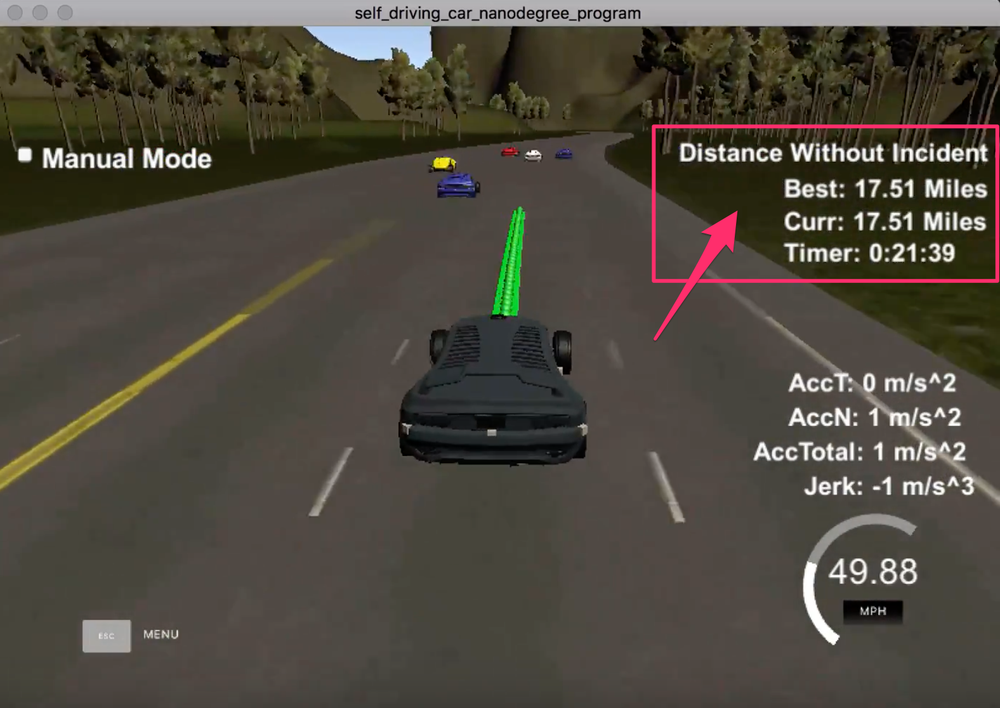
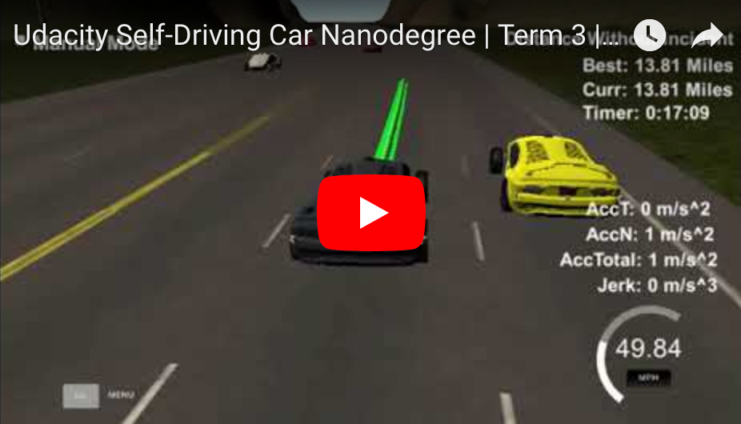

#### Udacity Self-Driving Car Engineer Nanodegree

# Term 3 / Project 11: Path Planning


##### &nbsp;

## Goal
The goal of this project is to autonomously drive a car on a virtual highway without any traffic incidents and while providing a smooth ride for the vehicle's passengers. For example, the vehicle cannot collide with other vehicles, violate any traffic laws, or create excessive jerk on the vehicle due to erratic steering or acceleration. There's a secondary goal to maximize the vehicle's driving speed measured in miles per hour (MPH). To achieve these goals, students must build a Path Planner that is able to detect other cars and safely navigate through traffic.

##### &nbsp;

## Requirements & Conditions
The speed limit is 50 MPH, but there is other traffic driving +-10 MPH of the speed limit. The car should try to go as close as possible to the 50 MPH speed limit, which means passing slower traffic when needed. Note that other cars will try to change lanes too. The car should avoid hitting other cars at all cost as well as driving inside of the marked road lanes at all times, unless switching from one lane to another. The car should be able to make one complete loop around the 6946m highway. Since the car is trying to go 50 MPH, it should take a little over 5 minutes to complete 1 loop.

#### Rubric Points
1. **The car is able to drive at least 4.32 miles without incident.** Each incident case is listed below.
1. **The car does not have collisions.** The car must not come into contact with any of the other cars on the road.
1. **The car drives according to the speed limit.** The car doesn't drive faster than the speed limit. Also the car isn't driving much slower than speed limit unless obstructed by traffic.
1. **Max acceleration and jerk are not exceeded.** The car does not exceed a total acceleration of 10 m/s^2 and a jerk of 10 m/s^3.
1. **The car stays in its lane.** Except when changing lanes, the car must stay inside one of the 3 lanes on the right hand portion of the road. When changing lanes, the car can't spend more than 3 seconds outside the lanes it's changing between.
1. **The car is able to change lanes.** The car is able to smoothly change lanes when it makes sense to do so, such as when behind a slower moving car and an adjacent lane is clear of other traffic.


##### &nbsp;

## Results
Ultimately, I was able to get my car to navigate the highway for over **17.5 miles** and **21.5 minutes without incident**.

</a>

[Here](https://youtu.be/3QYBQGf2RrE) is a video showing the results.

<a href="https://youtu.be/3QYBQGf2RrE"></a>

##### &nbsp;

## Approach
In building a path planner, there are many different approaches with varying levels of complexity. I decided to keep my approach as simple as possible, while leveraging much of the starter code provided in the [project walkthrough.](https://youtu.be/7sI3VHFPP0w)

All of my code can be found in `main.cpp` from line [line 249](https://github.com/tommytracey/Udacity-CarND-Term3/blob/master/p11-path-planning/src/main.cpp#L249) to 436 (below the helper functions provided by Udacity). There are three main sections:

1. **Prediction** &mdash; leverage our car's localization data and the sensor fusion data to detect other cars and determine their relative positions.
2. **Behavior** &mdash; given the above predictions, determine if and when our car should change lanes so that it can safely but also efficiently navigate through traffic.
3. **Trajectory** &mdash; given the above predictions and behavior model, calculate our car's path and feed it to the simulator.

##### &nbsp;

### Prediction

##### Data Provided
The map of the highway is in data/highway_map.txt. Each waypoint in the list contains `[x,y,s,dx,dy]` values. `x` and `y` are the waypoint's map coordinate position, the `s` value is the distance along the road to get to that waypoint in meters, the `dx` and `dy` values define the unit normal vector pointing outward of the highway loop.

The highway's waypoints loop around so the Frenet `s` value distance along the road goes from 0 to 6945.554.

Our car's localization data ([line 230](https://github.com/tommytracey/Udacity-CarND-Term3/blob/master/p11-path-planning/src/main.cpp#L230)):

```c++
  double car_x = j[1]["x"];  // Cartesian map coordinates
  double car_y = j[1]["y"];  // Cartesian map coordinates
  double car_s = j[1]["s"];  // Frenet coordinate, longitudinal distance from track start 0
  double car_d = j[1]["d"];  // Frenet coordinate, lateral distance from road median 0
  double car_yaw = j[1]["yaw"];  // steering angle / heading
  double car_speed = j[1]["speed"];
```
##### &nbsp;

The sensor fusion data provides a list of all other cars on our side of the road. Data for each car is a one dimensional vector: `[id, x, y, vx, vy, s, d]`. Note that `vx` and `vy` represent the car's velocity. All other variables are the same as the localization inputs.
```c++
auto sensor_fusion = j[1]["sensor_fusion"];
```
##### &nbsp;

With this data in hand, we can now determine the relative longitudinal (`s`) and lateral (`d`) distances of our car to other cars on the road.

First we need to initialize our own lane and velocity ([line 205](https://github.com/tommytracey/Udacity-CarND-Term3/blob/master/p11-path-planning/src/main.cpp#L205)):

```c++
// by default our car starts in lane 1
int lane = 1;

// initialize our reference velocity
double ref_vel = 0.0; // mph
```

##### &nbsp;

Based on `d` we can determine which lane each car is in ([line 258](https://github.com/tommytracey/Udacity-CarND-Term3/blob/master/p11-path-planning/src/main.cpp#L258)):


```c++
// initialize lane identifiers for other cars
bool car_ahead = false;
bool car_left = false;
bool car_right = false;

// which lane is the other car in
for (int i = 0; i < sensor_fusion.size(); i++) {
  float d = sensor_fusion[i][6];
  int car_lane;

  if (d >= 0 && d < 4) {
    car_lane = 0;  // left lane
  } else if (d >= 4 && d < 8) {
    car_lane = 1;  // middle lane
  } else if (d >= 8 && d <= 12) {
    car_lane = 2;  // right lane
  } else {
    continue;
  }
```

##### &nbsp;

We can then use the remaining fusion data to calculate each of the other car's positions (`s`).

```c++
// other car's velocity, speed, and position
double vx = sensor_fusion[i][3];
double vy = sensor_fusion[i][4];
double check_speed = sqrt(vx*vx + vy*vy);
double check_car_s = sensor_fusion[i][5];

// car s position after executing previous trajectory
check_car_s += ((double)prev_size*0.02*check_speed);
```

##### &nbsp;

</a>

#### This is where things get interesting.

Now that we have `s` and `d` for the other cars, we need to determine if any of the cars are within some minimum distance in our lane or an adjacent lane. The values you set for these distances will significantly impact how aggressively your car navigates through traffic. After several tuning iterations, I ultimately settled on the distance gap parameters below (also [line 287](https://github.com/tommytracey/Udacity-CarND-Term3/blob/master/p11-path-planning/src/main.cpp#L287)).

To summarize, the model identifies:
* a `car_ahead` if there is a car in my lane less than 20m ahead
* a `car_left` if there is a car in the lane to my left that is less than 60m ahead _and_ less than 5m behind my car.
* a `car_right` if there is a car in the lane to my right that is less than 60m ahead _and_ less than 5m behind my car.

```c++
// minimum distance gaps between our car and other cars
int gap_ahead_my_lane = 20; // m
int gap_ahead_oth_lane = 60; // m
int gap_behind = 5; // m

// determine if other car is within minimum distance gaps
if (car_lane == lane) {
  car_ahead |= (check_car_s > car_s) && ((check_car_s - car_s) < gap_ahead_my_lane);
} else if (lane - car_lane == 1) {
  car_left |= ((check_car_s + gap_behind) > car_s ) && ((check_car_s - gap_ahead_oth_lane) < car_s);
} else if (lane - car_lane == -1) {
  car_right |= ((check_car_s + gap_behind) > car_s ) && ((check_car_s - gap_ahead_oth_lane) < car_s);
}
```

##### &nbsp;

### Behavior

The basic strategy with choosing the above parameters is to make sure there is adequate room in either the left or right lane to pass the car ahead of me. This allows the car to more intelligently chose whether to pass on the left or right.

Also, the model is quite aggressive in that it allows my car to cut in front of other cars even if they're only 5m behind me. If you watch [the video](https://youtu.be/3QYBQGf2RrE?t=53s), you can see how this allows my car to navigate through tight spaces and avoid getting stuck in traffic. However, there is a safety risk. My car is more likely to cut-off another car and cause it to collide with me from behind. In real life this would be a huge concern and you'd want to set the `gap_behind` value higher. But in this simulation I found the risk of getting rear-ended was quite rare, so I kept this parameter at 5m.

Now equipped with the positions of the other cars, I can model my car's behavior according to the above strategy ([line 302](https://github.com/tommytracey/Udacity-CarND-Term3/blob/master/p11-path-planning/src/main.cpp#L302)):

```c++
// Behavior: modulate car to avoid collisions

double acc = 0.224;  // accelleration increment
double max_speed = 49.8;  // mph

// when there's a car ahead
if (car_ahead) {
  // if left lane is free, change to left lane
  if (lane > 0 && !car_left) {
  lane--;
  // otherwise if right lane is free, change to right lane
  } else if (lane < 2 && !car_right) {
    lane++;
  } else {
    // if left and right lanes are blocked then slow down
    ref_vel -= acc;
  }
// if there isn't a car ahead
} else {
  if (lane != 1) {
    // move back to the center lane if it's clear
    if ((lane == 0 && !car_right) || (lane == 2 && !car_left)) {
      lane = 1;
    }
  }
  // increase speed (up to speed limit)
  if (ref_vel < max_speed) {
    ref_vel += acc;
  }
}
```

##### &nbsp;

### Trajectory
The final task is to calculate an optimal trajectory based on the car's lane target, speed, coordinates, and most recent path points.

Here are the basic steps:
1. Transform the waypoints from track coordinates into the vehicle space.
1. Repurpose the last two points of the previous trajectory. If there isn't a previous trajectory then we use the car's most recent position in conjunction three distant points
1. Initialize the spline calculation. To simplify the math, the coordinates are transformed (shift and rotation) to local car coordinates.
1. Previous trajectory points are copied to the new trajectory to  maintain continuity.
1. The remaining trajectory points are calculated by evaluating the spline and then transforming the output coordinates back to local coordinates

You can view the code for this sequence of steps starting at [line 333 of main.cpp](https://github.com/tommytracey/Udacity-CarND-Term3/blob/master/p11-path-planning/src/main.cpp#L333).

##### &nbsp;

### Future Improvements
Ultimately, this is a simplistic approach that works well in a simulated driving environment that isn't terribly dynamic. Trying to extend this path planner to a more stochastic environment (such as an urban setting) would require many improvements.
* Finite state machine that accommodates greater complexity with a more comprehensive set of driving actions and states.
* Cost functions that reward/penalize a broader set of environment variables in order to determine the optimal path.
* Localization of other objects (not just cars) using sensor fusion.

##### &nbsp;

---

# Project Starter Code
In case you want to run this project yourself, below is the project starter code. This repository contains all the code needed to complete the final project for the Localization course in Udacity's Self-Driving Car Nanodegree.

### Simulator.
You can download the Term3 Simulator which contains the Path Planning Project from the [releases tab (https://github.com/udacity/self-driving-car-sim/releases/tag/T3_v1.2).

## Basic Build Instructions

1. Clone this repo.
2. Make a build directory: `mkdir build && cd build`
3. Compile: `cmake .. && make`
4. Run it: `./path_planning`.

Here is the data provided from the Simulator to the C++ Program

#### Main car's localization Data (No Noise)

["x"] The car's x position in map coordinates

["y"] The car's y position in map coordinates

["s"] The car's s position in frenet coordinates

["d"] The car's d position in frenet coordinates

["yaw"] The car's yaw angle in the map

["speed"] The car's speed in MPH

#### Previous path data given to the Planner

//Note: Return the previous list but with processed points removed, can be a nice tool to show how far along
the path has processed since last time.

["previous_path_x"] The previous list of x points previously given to the simulator

["previous_path_y"] The previous list of y points previously given to the simulator

#### Previous path's end s and d values

["end_path_s"] The previous list's last point's frenet s value

["end_path_d"] The previous list's last point's frenet d value

#### Sensor Fusion Data, a list of all other car's attributes on the same side of the road. (No Noise)

["sensor_fusion"] A 2d vector of cars and then that car's [car's unique ID, car's x position in map coordinates, car's y position in map coordinates, car's x velocity in m/s, car's y velocity in m/s, car's s position in frenet coordinates, car's d position in frenet coordinates.

## Details

1. The car uses a perfect controller and will visit every (x,y) point it recieves in the list every .02 seconds. The units for the (x,y) points are in meters and the spacing of the points determines the speed of the car. The vector going from a point to the next point in the list dictates the angle of the car. Acceleration both in the tangential and normal directions is measured along with the jerk, the rate of change of total Acceleration. The (x,y) point paths that the planner recieves should not have a total acceleration that goes over 10 m/s^2, also the jerk should not go over 50 m/s^3. (NOTE: As this is BETA, these requirements might change. Also currently jerk is over a .02 second interval, it would probably be better to average total acceleration over 1 second and measure jerk from that.

2. There will be some latency between the simulator running and the path planner returning a path, with optimized code usually its not very long maybe just 1-3 time steps. During this delay the simulator will continue using points that it was last given, because of this its a good idea to store the last points you have used so you can have a smooth transition. previous_path_x, and previous_path_y can be helpful for this transition since they show the last points given to the simulator controller with the processed points already removed. You would either return a path that extends this previous path or make sure to create a new path that has a smooth transition with this last path.

## Tips

A really helpful resource for doing this project and creating smooth trajectories was using http://kluge.in-chemnitz.de/opensource/spline/, the spline function is in a single hearder file is really easy to use.

---

## Dependencies

* cmake >= 3.5
  * All OSes: [click here for installation instructions](https://cmake.org/install/)
* make >= 4.1
  * Linux: make is installed by default on most Linux distros
  * Mac: [install Xcode command line tools to get make](https://developer.apple.com/xcode/features/)
  * Windows: [Click here for installation instructions](http://gnuwin32.sourceforge.net/packages/make.htm)
* gcc/g++ >= 5.4
  * Linux: gcc / g++ is installed by default on most Linux distros
  * Mac: same deal as make - [install Xcode command line tools]((https://developer.apple.com/xcode/features/)
  * Windows: recommend using [MinGW](http://www.mingw.org/)
* [uWebSockets](https://github.com/uWebSockets/uWebSockets)
  * Run either `install-mac.sh` or `install-ubuntu.sh`.
  * If you install from source, checkout to commit `e94b6e1`, i.e.
    ```
    git clone https://github.com/uWebSockets/uWebSockets
    cd uWebSockets
    git checkout e94b6e1
    ```

## Editor Settings

We've purposefully kept editor configuration files out of this repo in order to
keep it as simple and environment agnostic as possible. However, we recommend
using the following settings:

* indent using spaces
* set tab width to 2 spaces (keeps the matrices in source code aligned)

## Code Style

Please (do your best to) stick to [Google's C++ style guide](https://google.github.io/styleguide/cppguide.html).

## Project Instructions and Rubric

Note: regardless of the changes you make, your project must be buildable using
cmake and make!


## Call for IDE Profiles Pull Requests

Help your fellow students!

We decided to create Makefiles with cmake to keep this project as platform
agnostic as possible. Similarly, we omitted IDE profiles in order to ensure
that students don't feel pressured to use one IDE or another.

However! I'd love to help people get up and running with their IDEs of choice.
If you've created a profile for an IDE that you think other students would
appreciate, we'd love to have you add the requisite profile files and
instructions to ide_profiles/. For example if you wanted to add a VS Code
profile, you'd add:

* /ide_profiles/vscode/.vscode
* /ide_profiles/vscode/README.md

The README should explain what the profile does, how to take advantage of it,
and how to install it.

Frankly, I've never been involved in a project with multiple IDE profiles
before. I believe the best way to handle this would be to keep them out of the
repo root to avoid clutter. My expectation is that most profiles will include
instructions to copy files to a new location to get picked up by the IDE, but
that's just a guess.

One last note here: regardless of the IDE used, every submitted project must
still be compilable with cmake and make./

## How to write a README
A well written README file can enhance your project and portfolio.  Develop your abilities to create professional README files by completing [this free course](https://www.udacity.com/course/writing-readmes--ud777).
