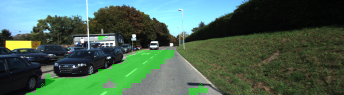
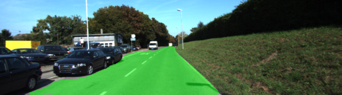
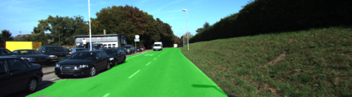
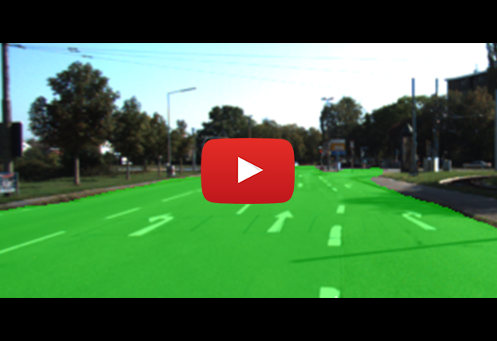
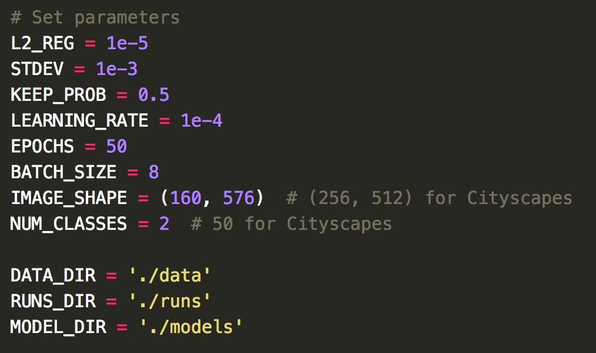
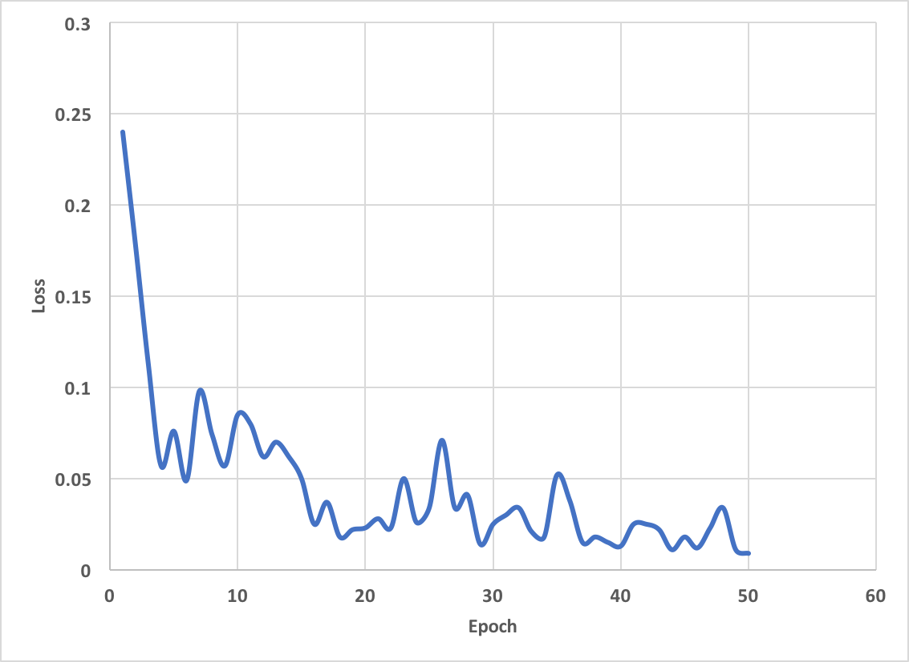
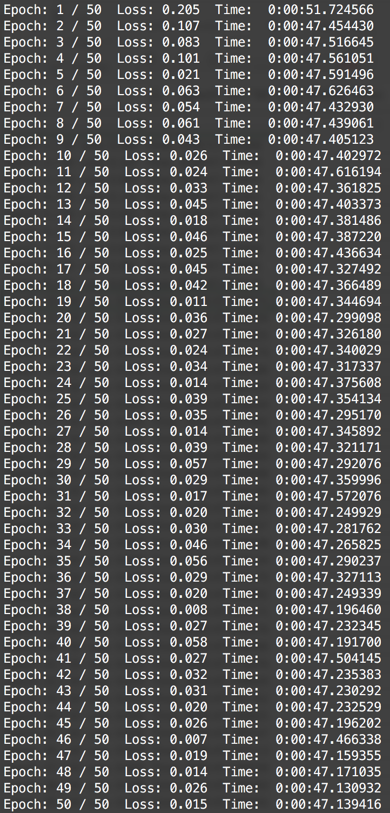

#### Udacity Self-Driving Car Engineer Nanodegree

# Term 3 / Project 12: Semantic Segmentation

<a href=""></a>
*Image credit: [Brad Sliz blog](http://bradsliz.com/2017-11-06-object-segmentation/)*

##### &nbsp;
## Goal & Approach
The goal of this project is to identify the road within a series of driving images. To do this, we use an approach called semantic segmentation, which enables us to associate each pixel of an image with a class label. In the most simple case for this project, the two classes are 'road' and 'not road.' However, it's possible to classify a variety of different objects such as cars, pedestrians, trees, bicyclists, etc.

For our semantic segmentation model we're required to build and train a Fully Convolutional Network (FCN), using [this research paper](https://people.eecs.berkeley.edu/~jonlong/long_shelhamer_fcn.pdf) from Berkeley as a guide.

Below is a diagram of the model architecture. Notice that there are two skip layers which feed the output from layer 3 and layer 4 in the encoder into the second and third layer of the decoder. This helps preserve fidelity that is otherwise lost through subsequent convolutions during encoding.

</a>

*Image credit: [PCA-aided Fully Convolutional Networks for Semantic Segmentation of Multi-channel fMRI](https://www.groundai.com/project/pca-aided-fully-convolutional-networks-for-semantic-segmentation-of-multi-channel-fmri/) by Lei Tai, Haoyang Ye, Qiong Ye, and Ming Liu*

##### &nbsp;
#### Data
The model was trained using the [KITTI road detection data set](http://www.cvlibs.net/datasets/kitti/eval_road.php).


##### &nbsp;
## Results
Although far from perfect, I was able to get my model to recognize the road with a good degree of accuracy after 20 epochs.

| Training        | Prediction Output           |
| ------------- |:-------------:|
| 1 epoch | </a>      |
| 10 epochs | </a>      |
| 20 epochs | </a>      |
| 50 epochs | </a>      |

##### &nbsp;
[Here](https://youtu.be/qWz-CXYuH_U) is a video showing all of the test results.

<a href="https://youtu.be/qWz-CXYuH_U"></a>

##### &nbsp;
Here are the hyperparameters used during training

</a>

##### &nbsp;
Here is the resulting cross-entropy loss.

</a>

</a>


##### &nbsp;
### Future Improvements
Ultimately, this is a simple approach that works well for this particular data set. Trying to extend this model for use on a self-driving car would require some improvements.
* Train on more robust data set such as [Cityscapes](https://www.cityscapes-dataset.com/).
* Add augmentation to generate more and more diverse training examples.
* Freeze model to improve performance.
* Add ability to take video as direct input.

##### &nbsp;

---

# Project Starter Code
In case you want to run this project yourself, below is the project starter code. [This repository](https://github.com/udacity/CarND-Semantic-Segmentation) contains all the code needed.

### Setup
##### GPU
`main.py` will check to make sure you are using GPU - if you don't have a GPU on your system, you can use AWS or another cloud computing platform.
##### Frameworks and Packages
Make sure you have the following is installed:
 - [Python 3](https://www.python.org/)
 - [TensorFlow](https://www.tensorflow.org/)
 - [NumPy](http://www.numpy.org/)
 - [SciPy](https://www.scipy.org/)
##### Dataset
Download the [Kitti Road dataset](http://www.cvlibs.net/datasets/kitti/eval_road.php) from [here](http://www.cvlibs.net/download.php?file=data_road.zip).  Extract the dataset in the `data` folder.  This will create the folder `data_road` with all the training a test images.

### Start
##### Implement
Implement the code in the `main.py` module indicated by the "TODO" comments.
The comments indicated with "OPTIONAL" tag are not required to complete.
##### Run
Run the following command to run the project:
```
python main.py train -ep=50 -bs=8
```
**Note** If running this in Jupyter Notebook system messages, such as those regarding test status, may appear in the terminal rather than the notebook.

### Submission
1. Ensure you've passed all the unit tests.
2. Ensure you pass all points on [the rubric](https://review.udacity.com/#!/rubrics/989/view).
3. Submit the following in a zip file.
 - `helper.py`
 - `main.py`
 - `project_tests.py`
 - Newest inference images from `runs` folder  (**all images from the most recent run**)

 ### Tips
- The link for the frozen `VGG16` model is hardcoded into `helper.py`.  The model can be found [here](https://s3-us-west-1.amazonaws.com/udacity-selfdrivingcar/vgg.zip)
- The model is not vanilla `VGG16`, but a fully convolutional version, which already contains the 1x1 convolutions to replace the fully connected layers. Please see this [forum post](https://discussions.udacity.com/t/here-is-some-advice-and-clarifications-about-the-semantic-segmentation-project/403100/8?u=subodh.malgonde) for more information.  A summary of additional points, follow.
- The original FCN-8s was trained in stages. The authors later uploaded a version that was trained all at once to their GitHub repo.  The version in the GitHub repo has one important difference: The outputs of pooling layers 3 and 4 are scaled before they are fed into the 1x1 convolutions.  As a result, some students have found that the model learns much better with the scaling layers included. The model may not converge substantially faster, but may reach a higher IoU and accuracy.
- When adding l2-regularization, setting a regularizer in the arguments of the `tf.layers` is not enough. Regularization loss terms must be manually added to your loss function. otherwise regularization is not implemented.

### Using GitHub and Creating Effective READMEs
If you are unfamiliar with GitHub , Udacity has a brief [GitHub tutorial](http://blog.udacity.com/2015/06/a-beginners-git-github-tutorial.html) to get you started. Udacity also provides a more detailed free [course on git and GitHub](https://www.udacity.com/course/how-to-use-git-and-github--ud775).

To learn about REAMDE files and Markdown, Udacity provides a free [course on READMEs](https://www.udacity.com/courses/ud777), as well.

GitHub also provides a [tutorial](https://guides.github.com/features/mastering-markdown/) about creating Markdown files.
